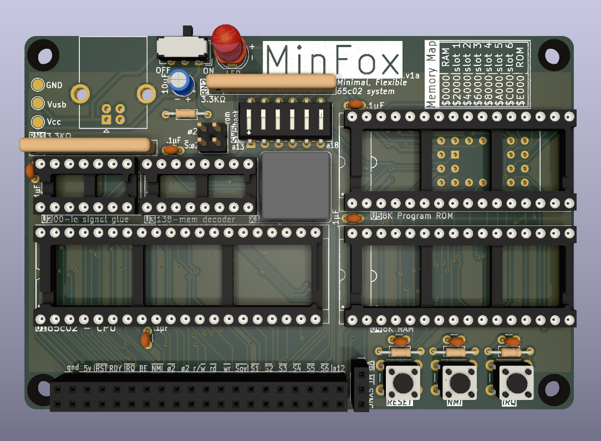

# MinFox

**NOTE: As of now, the board is untested, this README will be updated once proper tests with the physical board have taken place**

This is a minimal 65c02 board for prototyping, it provides ROM, RAM, 6 Chip Select lines (S1-S6), and a large jumper header with all the required signals to connect to daughter boards or to breadboards. The goal is to have a dumb, as simple as possible board for testing peripherals connected to a 65c02 bus.

All components are through hole, as to allow for an easier soldering experience and for the installation of sockets for IC reuse.

## Bill of Materials

* wdc65c02 CPU (dip-40)
* 74hc00 Quad Nand Gate (dip-14)
* 74hc138 3-to-8 Decoder (dip-16)
* Standard 62xxx SRAM (dip-28 or dip-32)
* Standard 28cXX EEPROM (dip-28) or 39SF0x0 Flash NOR (dip-32 or PLCC-32)
* Standard 1Mhz Clock Oscillator

* 2x20 Pin Socket (same size as RPi connector)
* 1x3  Pin Socket
* 2x2  Pin Header (+ 2 Jumpers)
* DIP-12 Switch
* Small 6-Pin Power Slide Switch
* USB-B Connector (power)

* 3xPush Buttons
* 1x470Ω
* 3x1KΩ
* 1x10µF Polarized Capacitor
* 8x0.1µF Capacitor
* 2x9pin Resistor Networks

The location and values of all components are also described in the board silk screen.

## Change Log

Board revisions  follow a `v$number$letter` naming scheme, the number symbolizes a board with new features and incompatibilities, while the letter symbolizes fixes and minor tweaks. The current version is **v1a**

### v1a

* Fixed breaking bug with /WR signal
* Added Screw Mounts
* Added Support for DIP-32 RAM and DIP-32/PLCC-32 Flash NOR chips
* Added Jumper for disconnecting clock oscillator
* Added Jumper for gating slot select signals with ø2
* Added dip switch for setting a ROM bank to use
* Added Set Overflow signal to the Connector
* Changed footprint of power slide switch
* Many tweaks to silkscreen